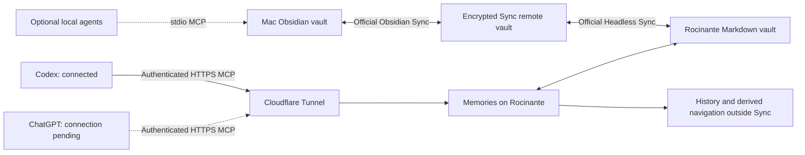

# Filesystem Memories

The September 2026 runtime makes the vault extended context for the owner's AI clients. Ordinary Markdown is durable knowledge. The MCP server reads current files, and ChatGPT/Codex does research and synthesis. PostgreSQL, embeddings, sensitivity scopes and a mandatory note protocol are absent from this runtime.

## Components



Solid connections are deployed and verified on 2026-09-13. Codex uses the remote server on Rocinante. ChatGPT's separate connection remains pending. A local agent can also run the filesystem MCP against its local synced copy through stdio; clients see the same notes after synchronization.

For a normal question, the AI client calls `kb_peek`, searches the topic and fetches useful notes, then researches and answers using that context. Useful new facts and corrections go back into ordinary Markdown through `kb_edit` or `kb_write`. The server saves the previous version on Rocinante, and Obsidian Sync carries the updated note to the Mac. Human edits in Mac Obsidian travel in the other direction. The server runs storage and search; the connected AI client supplies reasoning.

| Tool | Behavior |
|---|---|
| `kb_peek(topic?)` | Topic matches, recent notes, folder counts and maintenance summary |
| `search(query)` | Accent-insensitive lexical search of title, path, aliases, tags and content |
| `fetch(id)` | Complete current note and full-file SHA256 |
| `kb_write(path,content,expected_hash?)` | Create or replace normal Markdown; preserve the old version |
| `kb_edit(path,find,replace,expected_hash?)` | Replace exactly one text occurrence; preserve the rest |
| `kb_history(path)` | List previous MCP versions |
| `kb_restore(path,version)` | Restore a saved version, preserving the current version first |
| `kb_maintenance()` | Refresh links, duplicates, changed files and navigation reports |

`memories://overview` exposes bounded Markdown navigation. Search uses all supplied keywords, so use short topic phrases and separate searches for alternate names. It does not provide semantic/vector search. Reads are immediate; a scan is unnecessary for search freshness.

Visible `.md` files are supported. Optional frontmatter is read for metadata and otherwise preserved exactly. Hidden files, symlinks, traversal paths and files above 2 MiB are rejected. This is file containment, not a content or sensitivity policy. Authentication grants access to the owner's whole visible Markdown vault.

## Client behavior and cleanup

The installed `using-memories` skill starts relevant personal questions with KB context and encourages lasting, sourced updates during the owner's memory workflow. It avoids redundant notes and preserves uncertainty. The MCP server also advertises this workflow in its initialization instructions and tool descriptions. Neither mechanism can force every model to retrieve on every turn, or access unrelated conversations.

The HTTP process runs deterministic maintenance every 15 minutes. It stores full-file change hashes, deletion tracking, exact duplicate groups, broken/ambiguous links and a navigation overview outside the vault. Each scan reads the current collection; change tracking identifies incremental work, it is not an incremental filesystem index. Stdio clients can refresh through `kb_maintenance`.

Semantic cleanup happens in the active AI client: use the report, read the affected notes, repair unambiguous links and consolidate summaries while preserving original sources and unique details. No independent model job, paid API call or daily automation is configured. The server cannot wake ChatGPT itself. This borrows LLM Wiki's useful patterns—change hashes, link analysis and derived navigation—without its plugin UI, model framework or automatic source rewrites. No upstream source code was copied.

## Run and verify

Requires Node 22+ and pnpm 9.15.9. From the repository root:

```sh
pnpm install --filter @memories/memory-server... --frozen-lockfile
pnpm build
pnpm test
pnpm typecheck
cd apps/memory-server
node tests/compiled-smoke.mjs
```

Set `MEMORIES_VAULT` to the local vault and `MEMORIES_STATE` to a private directory outside it. `pnpm mcp` starts stdio. `pnpm mcp:http` starts loopback HTTP, requiring `MEMORIES_TOKEN` of at least 32 bytes. `MEMORIES_PORT` defaults to 3333 and `MEMORIES_MAINTENANCE_SECONDS` to 900.

HTTP accepts bearer authentication at `/mcp`. Optional `MEMORIES_CAPABILITY_URL=true` permits the exact `/<token>/mcp` URL for clients that cannot send headers. The complete capability URL is a credential: store it privately in the client, never in Markdown, logs or reports. Browser-origin requests are rejected. Public HTTPS goes through a local reverse proxy such as the installed Cloudflare Tunnel. This runtime does not implement OAuth.

[Systemd deployment and rollback](../deploy/README.md) describes service installation. The service uses an ordinary unprivileged user and a read-only filesystem except its vault, state and private temporary space.

History snapshots and derived state live outside Obsidian Sync. Back up that state separately. MCP history covers MCP changes, not every edit made by Obsidian or another application. Retain independent vault backups and Obsidian version history. Sync replicates deletion too; it is not an independent backup.

Every MCP writer on one host must use the same state directory. Its PID-owned lock serializes writes across processes and recovers dead owners. An ownerless/unrecognized lock fails after 15 seconds and requires inspection; never remove a live owner's lock. External editors and Sync do not participate in that lock. Full-file hashes detect observed intervening changes, but a filesystem compare followed by rename is not a transaction shared with Sync.

## Official Sync cutover

1. Keep a verified backup of the current Mac vault and old Sync configuration.
2. Sign into Obsidian on Mac and activate an existing Sync subscription. No subscription purchase has been made by this task.
3. Pause only the old Syncthing vault folder before connecting the new replication service. Do not disrupt other folders.
4. Seed a new/verified empty remote vault from the current Mac. Confirm account, vault identity and encryption before connecting an existing remote vault that could hold stale content.
5. On Rocinante, sign into `ob login`, inspect `ob sync-list-remote --json`, and configure the verified remote vault using `ob sync-setup --vault <verified-id> --path /home/jzfre/memories-vault --device-name rocinante`. Enter any encryption password interactively.
6. Complete an initial `ob sync`; compare relative paths and SHA256 of all Markdown files with the current Mac. Verify attachments separately according to the chosen Sync configuration. Exclude `.git`, private settings and runtime state from data replication.
7. Test a unique temporary note Mac → server, edit through MCP and verify server → Mac, then test deletion propagation. Remove the test note and preserve useful test evidence outside the vault.
8. Enable continuous Headless Sync with user lingering, then activate Memories and authenticated public routing. Restart both services and verify that synchronization and MCP reads still work.
9. Retire the old vault replication after the verified cutover; retain its configuration backup.

Never run desktop Sync and Headless Sync on the same device/vault. The Mac uses desktop Obsidian; Rocinante uses Headless Sync.

## Deployment record: 2026-09-13

- Codex is configured as `memories` using authenticated streamable HTTP to Rocinante. The installed Codex app-server discovered all eight tools, and the active Codex conversation successfully called `kb_peek`, `search` and `fetch`. This replaces the earlier local stdio configuration; the optional local runtime and its previous history at `/Users/jzfre/.local/state/memories` remain available.
- The new client skill is installed through the existing repository symlink. A fresh read-only Codex session implicitly invoked `kb_peek`, `search` and six `fetch` calls for a Rocinante question; its answer cited a retrieved rebuild note. No write tools were invoked.
- Initial local maintenance found 71 notes, zero exact duplicates/broken/ambiguous links and five notes without incoming links. An unlinked note is not automatically obsolete. The live vault subsequently grew to 72 notes.
- Rocinante runs Node 22.22.1 and official `obsidian-headless` 0.0.14. The end-to-end encrypted remote vault is `sovereign`, ID `87d1c8808f0481e74f8dd830c8419500`, North America. Its 72 visible files were initially downloaded in pull-only mode and matched the Mac by SHA256.
- Headless now runs continuously in bidirectional mode with conflict copies and no configuration sync. Its user service is enabled and lingering is on. Mac create/server edit, creation in the other direction, and deletions in both directions passed using a temporary note that was removed afterward.
- Homebrew Syncthing is stopped on Mac; `syncthing@jzfre.service` is inactive/disabled on Rocinante. Existing configuration and encrypted backups are retained.
- Production `memories.service` is active/enabled. It binds only `127.0.0.1:3333`; Cloudflare publishes `mcp.aqui.technology`. Live public HTTPS checks passed 401 without credentials, bearer and capability authentication, eight-tool discovery, search/fetch/create/edit/history, and exact-content restore after an actual service restart.
- Both production services were restarted. The restored verification note reached the Mac after exceeding the first 45-second wait; its contents were verified and it was then removed from both replicas. No cause was established for that delivery delay.
- The final 20-file application/config/unit manifest matched Mac and Rocinante: SHA256 `6f7363731fb93bfe554005377e4e7a29645681f00eed9df44fd81fbe2ff7e757`.
- A subsequent test-only continuation added capability-URL and startup-boundary coverage: 48 tests pass locally; the five HTTP tests and typecheck also pass on Rocinante. The earlier manifest is the initial staged snapshot, before this additional test file update. Runtime source is unchanged.
- Cloudflare MCP DNS now targets the Rocinante tunnel. `memories.aqui.technology`, the older web-editor hostname, was not migrated. The actual ChatGPT connection refresh and client test remain pending; the private connection URL is stored outside the vault in the owner's client configuration directory.
- Current architecture, retired protocol status and implementation evidence were written to four existing vault notes through MCP, with original-version history and readback verified.
- A fresh encrypted vault-and-history backup was decrypted/read successfully (143 regular files) and copied identically to Rocinante: `/Users/jzfre/.local/share/memories-backups/20260913T070239Z-filesystem-memories.tar.age`, SHA256 `4b677985405c0794760f69d78ce4f6f93dbe011c9fe5dce28483e15116d562f1`. Remote directory: `/home/jzfre/.local/share/memories-backups/`.
- Before the authorized encryption reset, another verified temporary copy and encrypted archive were created: `20260913T130210Z-before-sync-reset.tar.age`, SHA256 `c94feac5c1cca49c25a7adb2a4b4fada16adb6e93506b2c8e933394d892a95a1`. The archive includes the complete local vault, local MCP history/state and old Syncthing configuration; its remote copy is identical.
- The post-activation backup `20260913T182554Z-memories-live.tar.age` contains 138 regular vault files, including 72 visible Markdown notes, plus local MCP history/state. Decryption and vault hashes were verified, as was the identical Rocinante copy; SHA256 `980491f045f606b8dce47d1c9880f2b844eb4efd252b3cddaa13d88ea176eb72`.
- Before publishing the repository, fresh checks passed all 48 filesystem-runtime tests, typecheck, build and the compiled create/edit/restart/restore smoke test. The Mac and Rocinante still matched on all 72 visible Markdown files. Memories, Headless Sync and cloudflared were active/enabled; Syncthing remained stopped on both hosts.

## References

- [Official Obsidian Headless](https://obsidian.md/help/headless)
- [Official Headless Sync](https://obsidian.md/help/sync/headless)
- [Obsidian Headless source](https://github.com/obsidianmd/obsidian-headless)
- [MCP TypeScript SDK](https://github.com/modelcontextprotocol/typescript-sdk)
- [Codex MCP configuration and server instructions](https://developers.openai.com/codex/mcp)
- [ChatGPT plugin connection](https://developers.openai.com/plugins/deploy/connect-chatgpt)
- [LLM Wiki source and design patterns](https://github.com/gd4ai/obsidian-llm-wiki)
