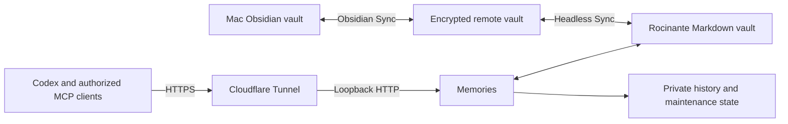

# Architecture and operation

The Markdown vault is the knowledge base. The Mac uses Obsidian desktop Sync; Rocinante uses official Headless Sync and runs Memories against its local copy. The initial server copy must come from the current Mac vault. After verification, changes travel in both directions.



Rocinante serves `https://mcp.aqui.technology/mcp`. Codex is connected. The separate ChatGPT web connection remains pending until authentication, tool discovery and a real retrieval are verified in that client. There is no Obsidian desktop process on Rocinante. Official Headless is currently in open beta. See [Obsidian Headless](https://obsidian.md/help/headless) and [Headless Sync](https://obsidian.md/help/sync/headless).

## Client workflow and tools

For a question involving the owner's life, projects or prior decisions, start with `kb_peek`, search the topic, then fetch the useful notes. Verify facts that may have changed. Save lasting findings and corrections in the relevant notes, retaining sources and uncertainty. The [client skill](../skills/using-memories/SKILL.md) and MCP initialization instructions describe this behavior; the server cannot force every model to retrieve on every turn.

| Tool | Operation |
|---|---|
| `kb_peek(topic?, limit?)` | Relevant snippets, recent notes, folder counts and maintenance summary |
| `search(query, limit?)` | Ranked lexical search across titles, paths, aliases, tags and note text |
| `fetch(id)` | Complete current note, metadata and full-file SHA-256; `id` is its relative path |
| `kb_write(path, content, expected_hash?)` | Create or replace Markdown, preserving an existing version |
| `kb_edit(path, find, replace, expected_hash?)` | Replace exactly one occurrence, preserving the rest of the note |
| `kb_history(path)` | List previous MCP versions |
| `kb_restore(path, version)` | Restore a version, saving the current content first |
| `kb_maintenance()` | Refresh changed-file, duplicate, link and navigation reports |

The `memories://overview` resource provides bounded Markdown navigation.

Search is accent-insensitive and requires every supplied keyword to match somewhere in a note's searchable fields. Use short topic phrases; try alternate names in separate searches. Results contain bounded snippets; fetch the note before relying on details or editing it. Search reads current files directly and needs no maintenance scan to become fresh.

Optional YAML frontmatter supplies title, tags and aliases. Ordinary Markdown without frontmatter works too. Writes preserve the content supplied by the client without imposing a note template.

## Configuration and access

| Variable | Purpose | Default |
|---|---|---|
| `MEMORIES_VAULT` | Absolute local vault path | Required |
| `MEMORIES_STATE` | Private state directory outside the vault | `~/.local/state/memories` |
| `MEMORIES_TOKEN` | HTTP bearer credential; runtime requires at least 32 bytes, deployment generates 32 random bytes | Required for HTTP |
| `MEMORIES_PORT` | Loopback HTTP port | `3333` |
| `MEMORIES_CAPABILITY_URL` | Allow a credential-bearing URL for clients without custom headers | `false` |
| `MEMORIES_MAINTENANCE_SECONDS` | HTTP maintenance interval, at least 10 seconds | `900` |

The runtime reads environment variables from its process; it does not load a `.env` file automatically. The systemd deployment uses a private `EnvironmentFile`.

HTTP uses `Authorization: Bearer <token>` at `/mcp`. The listener binds loopback and public access goes through HTTPS. Requests with a browser `Origin` header are rejected. Direct browser JavaScript is not a supported client transport. The HTTP service accepts JSON POST requests with bodies smaller than 3 MiB.

When explicitly enabled, capability mode also accepts `/<token>/mcp`. The entire URL is a credential. Keep it in private client configuration, never in a note, log, screenshot or repository. This service does not implement an OAuth sign-in flow.

There is one HTTP credential and one visible Markdown vault. Every authenticated client has the same tool access; rotating the credential invalidates all clients using it. Stdio access uses the permissions of the local account that starts the process, so it needs no bearer header. A cloud service must reach the HTTPS endpoint rather than a local stdio process.

## Writes, recovery and limits

- Paths are vault-relative and end in `.md`. Hidden paths, traversal, symlinks, non-regular files and notes larger than 2 MiB are rejected.
- Read the note first and pass its SHA-256 as `expected_hash` when updating. An empty hash means create only. A conflict means fetch again and reconcile the change. `kb_edit` also checks the version it read internally.
- Writes use a temporary file and atomic rename. Existing content is saved outside the synced vault before an MCP replacement or restoration.
- Every MCP writer for a vault on one host must share `MEMORIES_STATE`. Its process-owned lock serializes writes and can recover a dead owner. A live owner is never cleared automatically. An ownerless or unrecognized lock fails after 15 seconds and requires operator inspection.
- External editors and Sync do not acquire that lock. Hash checks detect observed intervening changes, but the final compare and rename are not a transaction shared with those applications. Keep conflict copies and recoverable history.

MCP history covers MCP changes, not every edit by another application. Back up the complete vault and private state independently, retain Obsidian version history, and verify restoration. Sync propagates deletions as well as edits. Runtime state contains previous note content and requires the same privacy as the vault.

## Maintenance

The HTTP process refreshes reports at startup and every 15 minutes by default. `pnpm maintenance` or `kb_maintenance` refreshes them on demand. Reports contain changed and deleted paths, exact duplicate groups, broken or ambiguous links, notes without incoming links, and a navigation summary. Each refresh reads the current collection; hashes identify changes between runs.

Maintenance does not merge or delete source notes. An unlinked note is not automatically obsolete, and a broken-link report needs context before repair. The connected AI client can use these reports to consolidate related findings and repair links while preserving sources and unique details. No independent model job or scheduled semantic rewriting is configured; the server does not wake ChatGPT.

## Verification

From the repository root:

```sh
pnpm test
pnpm typecheck
pnpm build
pnpm test:compiled
```

Tests use temporary vaults. Before activating or upgrading a deployment, also verify unauthenticated denial, authenticated tool discovery, search/fetch, a temporary-note edit, restoration after service restart, and synchronization in both directions. The [deployment guide](../deploy/README.md) covers service configuration and recovery.
